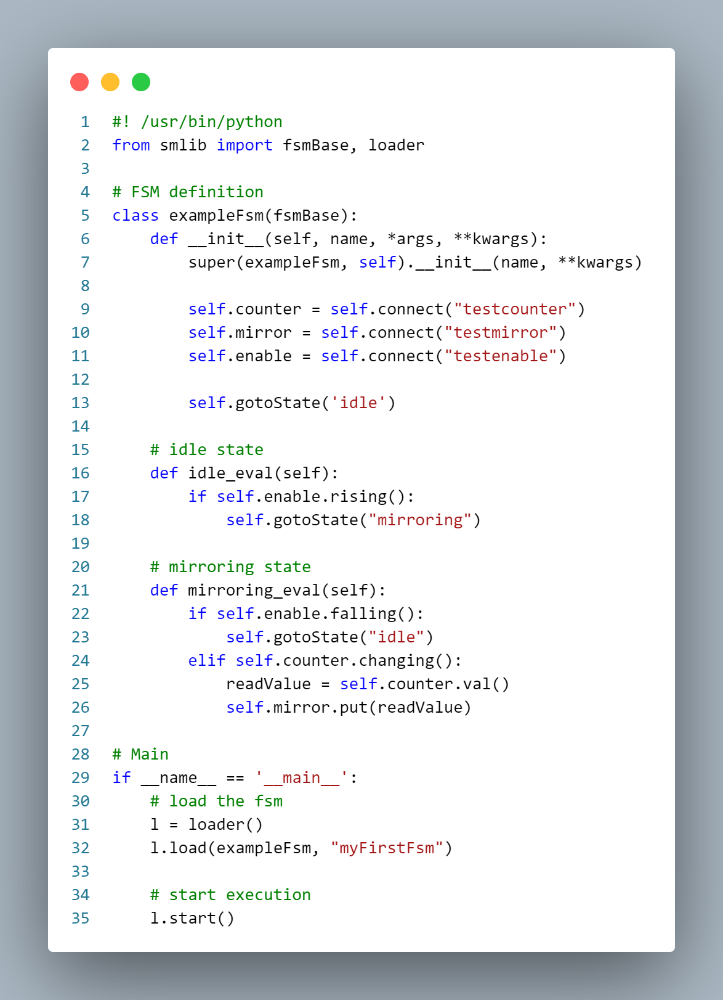

# pysmlib

## Python Finite State Machines for EPICS

_Developers_: Damiano Bortolato - Davide Marcato @ Laboratori Nazionali di Legnaro - INFN

Main Repository: https://github.com/darcato/pysmlib

Full documentation: https://darcato.github.io/pysmlib/docs/html/

### Main features

- Easy to use and fast development of complex event based fsm - just code the states!
- Full EPICS Channel Access integration via PyEpics.
- High expandability as provided by all the libraries of Python.
- Integrated configurable logging systems.
- Convenient methods to access all the information on I/O.
- Timers can be used to execute actions after a time delay.
- Integrated watchdog logic.
- Multi-threading: each fsm is executed on a different thread, sharing I/O.
- Convenient loader to launch a daemon with multiple fsm.
- Possibility to apply a configurable naming convention on I/O.

## Installation

To install simply run:

``` bash
pip install pysmlib
```

or download the latest release/sources from github, unpack it and run:

``` bash
cd pysmlib
pip install .
```

### Dependencies

Requires Python 3.6+. Pyepics is
required and automatically installed by pip. Sphinx and its theme "Read the
Docs" are required to build the documentation.

## Example


